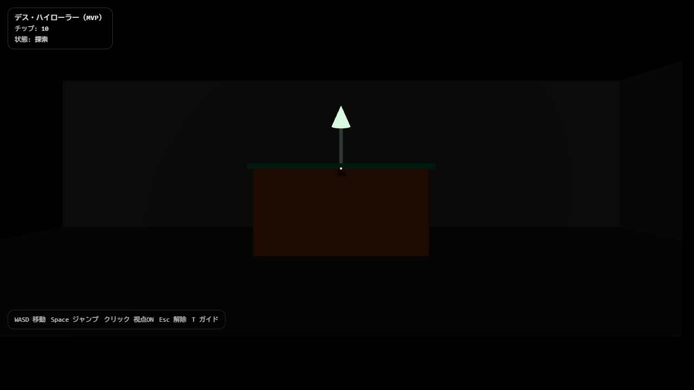
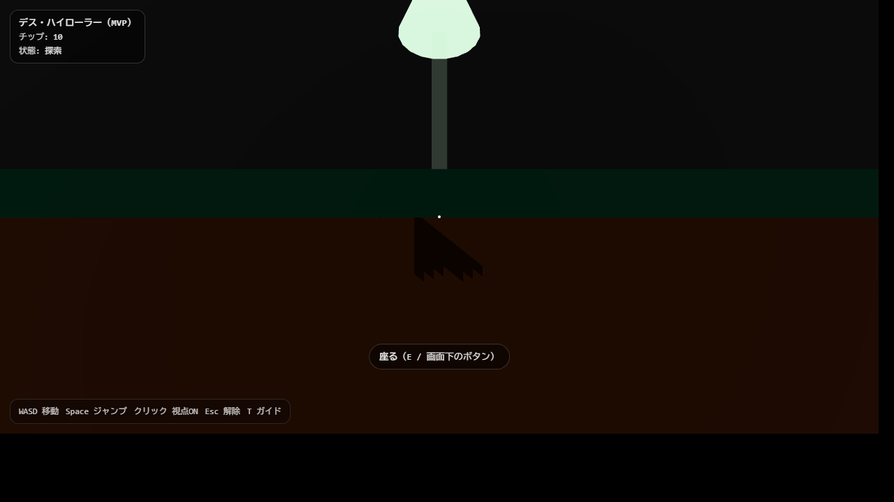
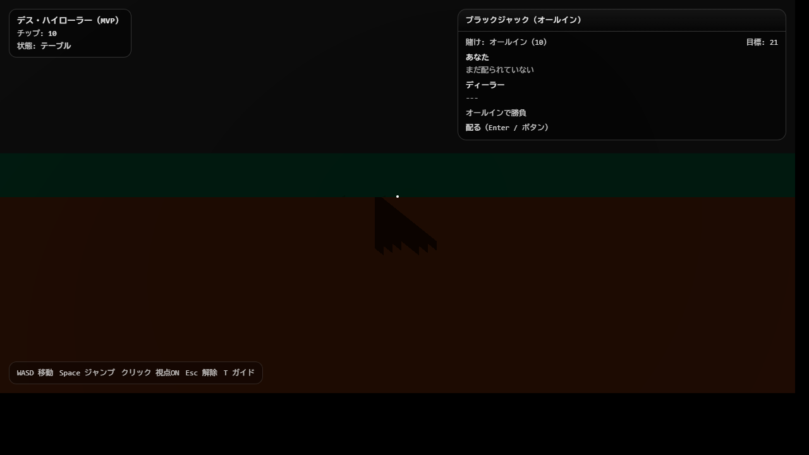
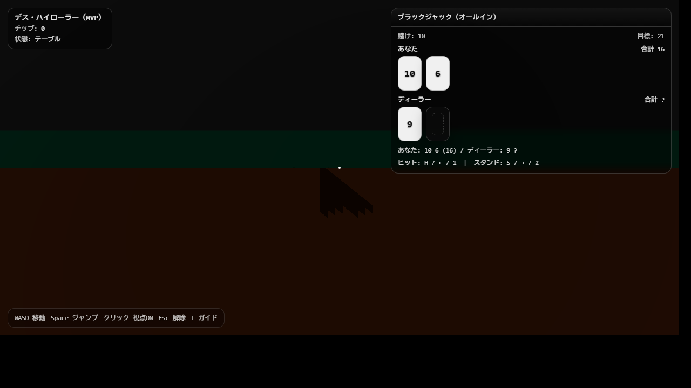
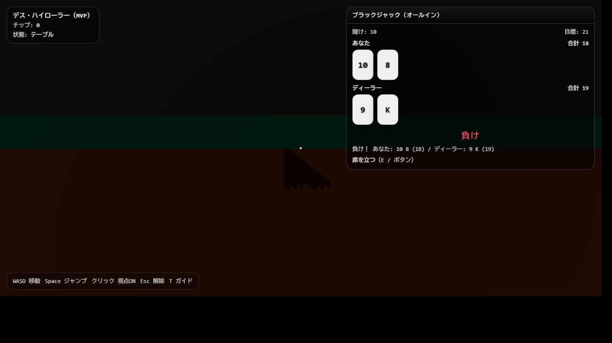
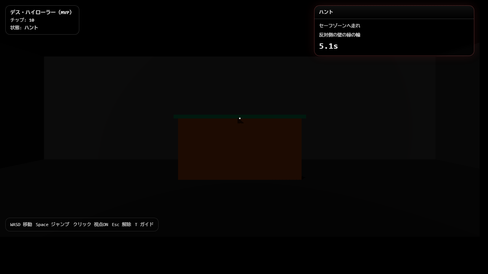
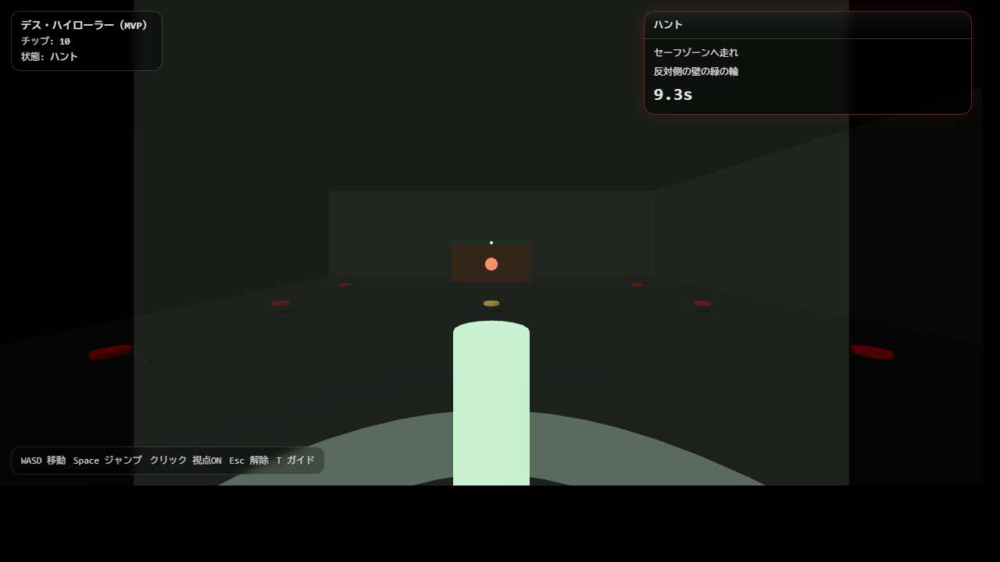
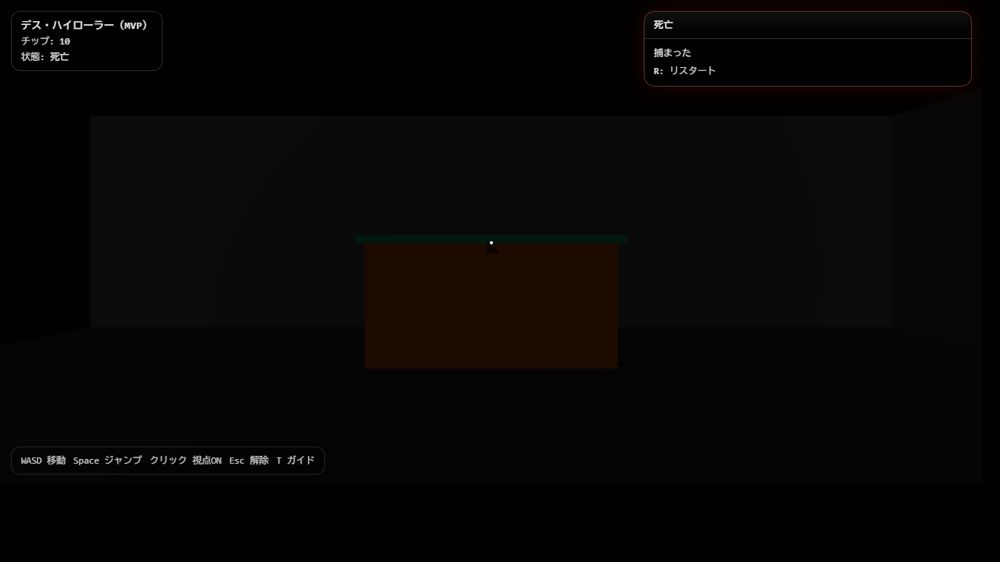

# Death High Roller (MVP) - POCメディア

ヘッドレス Chrome で `?capture=...` プリセットを使って自動生成したスクショです。

## ストーリーボード

### 01 探索



### 02 テーブル付近（プロンプト）



### 03 テーブル（待機）



### 04 テーブル（プレイ中）



### 05 テーブル（負け）



### 06 ハント（追跡）



### 07 ハント（セーフゾーン）



### 08 死亡



## 再生成

```powershell
cd ghost-kitchen
npm run build

$chrome = "C:\\Program Files\\Google\\Chrome\\Application\\chrome.exe"
$outDir = (Resolve-Path "docs\\poc_media").Path
$port = 4173

$p = Start-Process -FilePath "cmd.exe" -ArgumentList "/c", "npm run preview -- --host 127.0.0.1 --port $port --strictPort" -WorkingDirectory (Get-Location) -PassThru -WindowStyle Hidden
try {
  for ($i = 0; $i -lt 60; $i++) {
    try {
      $r = Invoke-WebRequest -UseBasicParsing -TimeoutSec 2 "http://127.0.0.1:$port/"
      if ($r.StatusCode -eq 200) { break }
    } catch {}
    Start-Sleep -Milliseconds 500
  }

  $shots = @(
    @{ name = "01_explore.png";        capture = "explore";        budget = 5000 }
    @{ name = "02_near_table.png";     capture = "near-table";     budget = 5000 }
    @{ name = "03_table_idle.png";     capture = "table-idle";     budget = 5000 }
    @{ name = "04_table_playing.png";  capture = "table-playing";  budget = 5000 }
    @{ name = "05_table_lose.png";     capture = "table-lose";     budget = 5000 }
    @{ name = "06_haunt_chase.png";    capture = "haunt-chase";    budget = 5000 }
    @{ name = "07_haunt_safezone.png"; capture = "haunt-safezone"; budget = 800  }
    @{ name = "08_dead.png";          capture = "dead";           budget = 2000 }
  )

  foreach ($s in $shots) {
    $out = Join-Path $outDir $s.name
    $url = "http://127.0.0.1:$port/?capture=$($s.capture)"
    & $chrome --headless=new --disable-gpu --use-gl=swiftshader --window-size=1280,720 --hide-scrollbars --virtual-time-budget=$($s.budget) --screenshot="$out" $url | Out-Null
  }
} finally {
  if ($p -and !$p.HasExited) { Stop-Process -Id $p.Id -Force }
}
```
