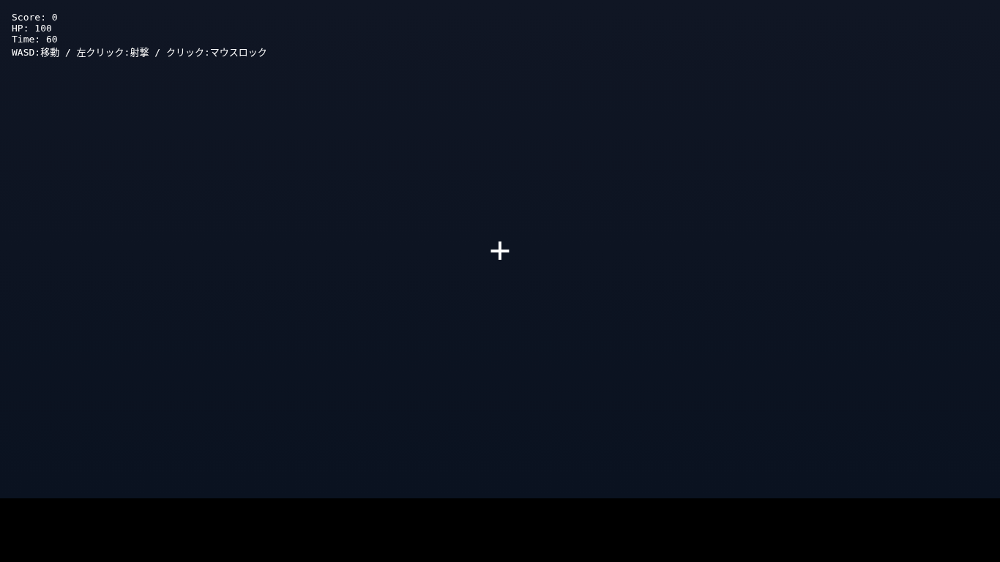
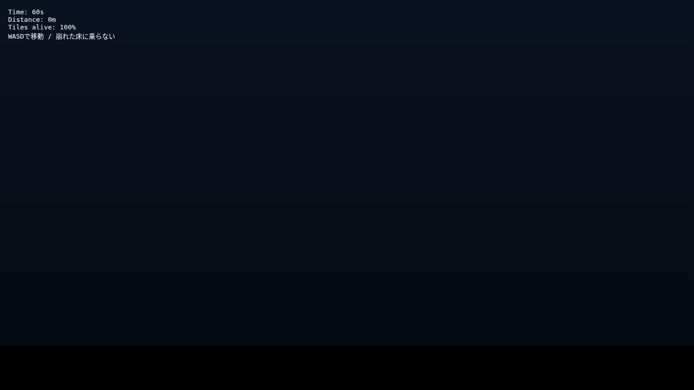
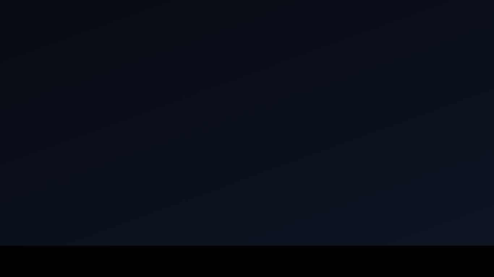

# プレイ画像 / アニメーション

## モード一覧
- FPS: `?mode=fps`
- 崩壊レース: `?mode=race`
- 重力反転: `?mode=gravity`
- 東京サンドボックス: `?mode=tokyo`

## FPS

### PNG

### GIF (自動キャプチャ)

## 1分地形崩壊レース

### PNG

### GIF (自動キャプチャ)

## 重力反転

### PNG

### GIF (自動キャプチャ)

## 東京サンドボックス

### 補足
- `?mode=tokyo&asset=1` で `/public/assets/tokyo/*.glb` の読み込みを有効化

### PNG

### GIF (自動キャプチャ)

